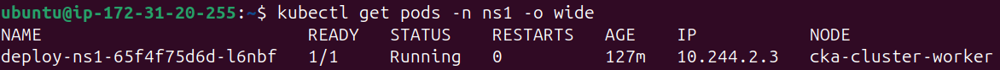
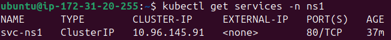
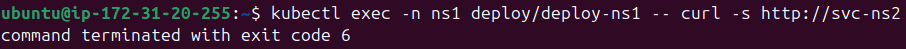

## Namespaces DNS Test
This test verifies pod-to-pod and service-to-service communication across Kubernetes namespaces using Pod IPs, Service IPs, and FQDNs (Fully Qualified Domain Name). It also demonstrates that short Service names work only within the same namespace.

### 1. Create two namespaces

```bash
kubectl create namespace ns1
kubectl create namespace ns2
```

Verify:
```bash
kubectl get namespaces
```

### 2. Create one Nginx Deployment in each namespace

```bash
kubectl create deployment deploy-ns1 --image=nginx -n ns1

kubectl create deployment deploy-ns2 --image=nginx -n ns2
```
Wait until both are ready:
```bash
kubectl rollout status deployment/deploy-ns1 -n ns1
kubectl rollout status deployment/deploy-ns2 -n ns2
```
- ```kubectl create deployment``` creates the Deployment and its Pods in the specified namespace.


### 3. View the Pod names and IP addresses

```bash
kubectl get pods -n ns1 -o wide
kubectl get pods -n ns2 -o wide
```


Store the Pod IP in ns2:
```bash
POD_NS2_IP=$(kubectl get pods -n ns2 -l app=deploy-ns2 -o jsonpath='{.items[0].status.podIP}')

echo "$POD_NS2_IP"
```

### 4. Connect directly from the ```ns1``` Pod to the ```ns2``` Pod

```bash
kubectl exec -n ns1 deploy/deploy-ns1 -- curl -s "http://$POD_NS2_IP"
```

- It results in receiving the Nginx welcome page.
- ```kubectl exec deploy/<name>``` executes the command inside one of the Deployment’s Pods.
- ```-s``` means silent mode. It hides the progress meter and error messages, but still prints the response body.

### 5. Inspect the Pod DNS configuration

```bash
kubectl exec -n ns1 deploy/deploy-ns1 -- \
  cat /etc/resolv.conf
```

You will normally see search domains similar to: 

```search ns1.svc.cluster.local svc.cluster.local cluster.local```

### 6. Scale both Deployments to three replicas

```bash
kubectl scale deployment/deploy-ns1 --replicas=3 -n ns1
kubectl scale deployment/deploy-ns2 --replicas=3 -n ns2
```

Verify:
```bash
kubectl get pods -n ns1
kubectl get pods -n ns2
```

- ```kubectl scale``` changes the requested number of Deployment replicas.

### 7. Expose both Deployments as ClusterIP Services

```bash
kubectl expose deployment deploy-ns1 --name=svc-ns1 --type=ClusterIP --port=80 --target-port=80 -n ns1

kubectl expose deployment deploy-ns2 --name=svc-ns2 --type=ClusterIP --port=80 --target-port=80 -n ns2
```

Verify:

```bash
kubectl get services -n ns1
kubectl get services -n ns2
```



- ```kubectl expose deployment``` creates a Service whose selector targets the Deployment’s Pods.

### 8. Connect using the other Service’s ClusterIP

Store the Service IPs:

```bash
SVC_NS1_IP=$(kubectl get service svc-ns1 -n ns1 -o jsonpath='{.spec.clusterIP}')

SVC_NS2_IP=$(kubectl get service svc-ns2 -n ns2 -o jsonpath='{.spec.clusterIP}')
```

From ```ns1``` to the Service in ```ns2```:

```bash
kubectl exec -n ns1 deploy/deploy-ns1 -- curl -s "http://$SVC_NS2_IP"
```

From ```ns2``` to the Service in ```ns1```:

```bash
kubectl exec -n ns2 deploy/deploy-ns2 -- curl -s "http://$SVC_NS1_IP"
```

- **Both should work.**

### 9. Try using only the Service name

From ```ns1```:

```bash
kubectl exec -n ns1 deploy/deploy-ns1 -- curl -s http://svc-ns2
```
- This should fail with a DNS resolution error because svc-ns2 is not in ns1. 


From ```ns2```:

```bash
kubectl exec -n ns2 deploy/deploy-ns2 -- curl -s http://svc-ns1
```
- A short Service name is searched in the caller’s own namespace.

### 10. Connect using the cross-namespace FQDN

From ```ns1``` to ```svc-ns2```:

```bash
kubectl exec -n ns1 deploy/deploy-ns1 -- curl -s http://svc-ns2.ns2.svc.cluster.local
```
From ```ns2``` to ```svc-ns1```:

```bash
kubectl exec -n ns2 deploy/deploy-ns2 -- \
  curl -s http://svc-ns1.ns1.svc.cluster.local
```

- Both should work.

- **The standard Service DNS format** is: ```<service-name>.<namespace>.svc.cluster.local``` 
- The cluster domain can be configured differently, but cluster.local is the common default.

### 11. Delete everything

```bash
kubectl delete namespace ns1 ns2
```

- Deleting the namespaces also deletes the Deployments, Pods, and Services inside them.